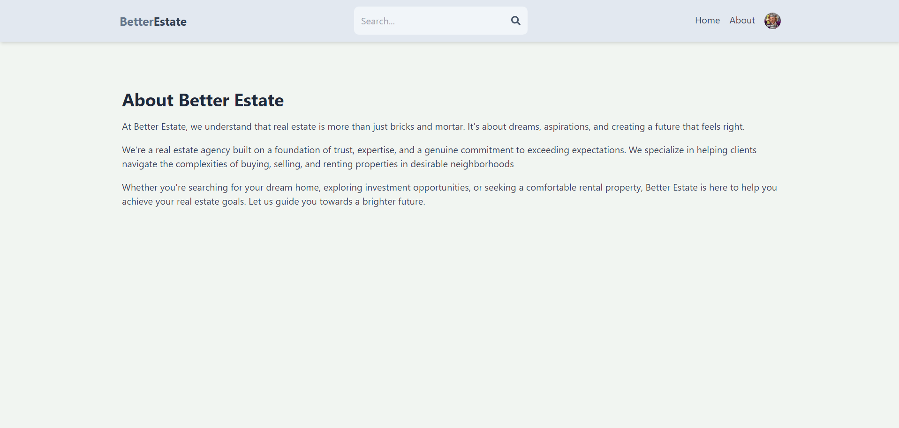

# Better Estate: A MERN Stack Real Estate Platform

Welcome to the Estate Broker site! This application is built using the MERN stack (MongoDB, Express, React, Node.js) and provides a seamless platform for users to manage their estate listings. Users can create accounts, authenticate via Google, and manage their property listings with ease.

## Key Technologies:

- Frontend: React
- Backend: Express
- Database: MongoDB Atlas
- Styling: Tailwind CSS
- Icons: React Icons
- Authentication: Google Firebase Authentication, JWT
- Storage: Firebase Storage for images
- Development Tools: Mongoose, bcryptjs, Nodemon

## Features

-  User Management:

User Registration: Create new user accounts with name, email, and password.

User Authentication: Secure login with password authentication and Google Firebase integration.

User Profile Management: Update user details, change passwords, and upload profile pictures.

- Estate Listing Management:

Create Listing: Users can create their own estate listings with details like address, description, images, and price.

Update Listing: Edit and update existing listings with new information or images.

- Delete Listing: Remove listings from the platform.

View Listings: Users can browse and search for available listings.

- Data Storage:

MongoDB Atlas: Stores user information and estate listing data.

Firebase Storage: Securely stores images for listings.

- Authentication:

JWT (JSON Web Tokens): Used for secure user authentication and authorization.

Bcryptjs: Encrypts passwords before storing them in the database.

- Development Process:

Nodemon: Enables faster backend development by automatically restarting the server when code changes are detected.

## API Reference

API Documentation
Authentication Endpoints

    POST /api/auth/signup
        Description: Stores user credentials in MongoDB.

    POST /api/auth/signin
        Description: Authenticates user using email and password; returns a JWT access token.

    POST /api/auth/google
        Description: Authenticates user with Google and stores data in MongoDB.

    GET /api/auth/signout
        Description: Clears cookies and signs out the user.

Listing Endpoints

    POST /api/listing/create
        Description: Stores estate data in MongoDB.

    DELETE /api/listing/delete/:id
        Description: Deletes estate data with matching ID from the URL parameters.

    POST /api/listing/update/:id
        Description: Updates estate data with matching ID from the URL parameters.

    GET /api/listing/get/:id
        Description: Retrieves estate data with matching ID from the URL parameters.

    GET /api/listing/get
        Description: Retrieves estate data based on request query parameters.

User Endpoints

    POST /api/user/update/:id
        Description: Updates user data with matching ID from the URL parameters.

    DELETE /api/user/delete/:id
        Description: Deletes user data with matching ID from the URL parameters.

    GET /api/user/listings/:id
        Description: Retrieves all estate data created by a specific user with matching ID from the URL parameters.

    GET /api/user/:id
        Description: Retrieves user data with matching ID from the URL parameters.

## Images

## Feedback

If you have any feedback, please reach out to us at anonymousunknown9856@gmail.com

